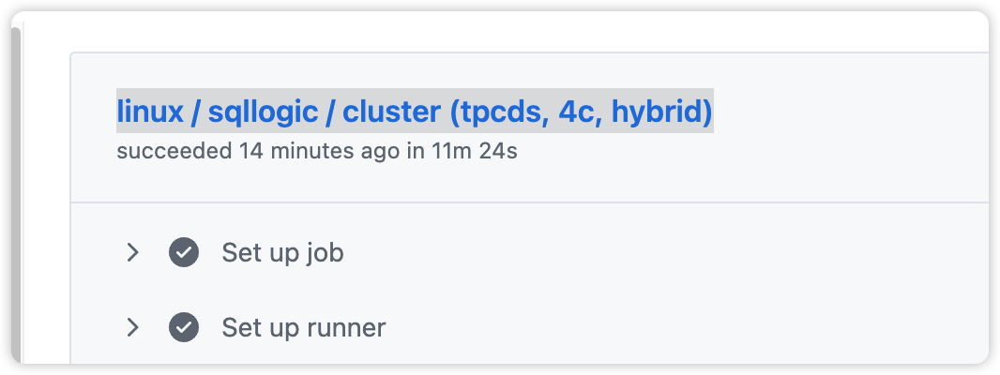

## rerun_job.sh

用于持续重跑指定 GitHub Actions job，并在失败时退出并提示。

### 依赖

- `gh` CLI，并已完成认证且具备仓库权限
- `jq`
- macOS 可选：用于失败告警音的 `afplay`（非 macOS 可自行移除相关代码）

### 配置

**必须保证  `rerun_job.sh`  在对应的仓库下**。 

打开 `rerun_job.sh` 并修改以下变量：

- `RUN_ID`：目标 workflow run ID
- `JOB_NAME`：目标 job 名称（必须与 GitHub Actions 中显示的名称完全一致）


job_name:


### 使用方法

```bash
chmod +x rerun_job.sh
./rerun_job.sh
```

脚本会在 job 成功后继续重跑；如果 job 失败，会打印链接并退出。停止运行可用 `Ctrl+C`。

### 常见问题

- 如果提示找不到 job，检查 `JOB_NAME` 是否完全匹配，以及 `RUN_ID` 是否对应正确的 workflow run。
- 如果遇到 API 错误，脚本会自动重试；持续失败时请检查网络或 `gh auth status`。
